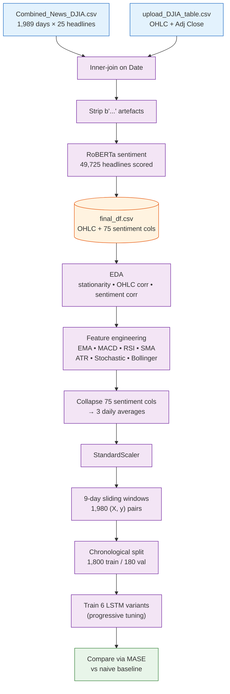
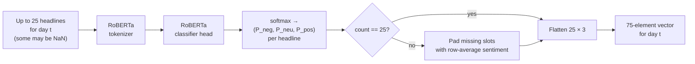
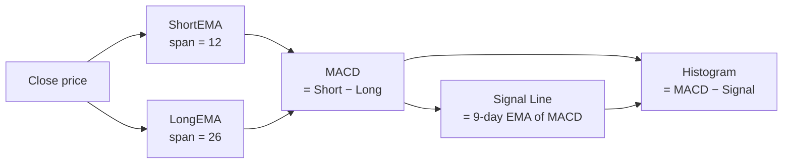
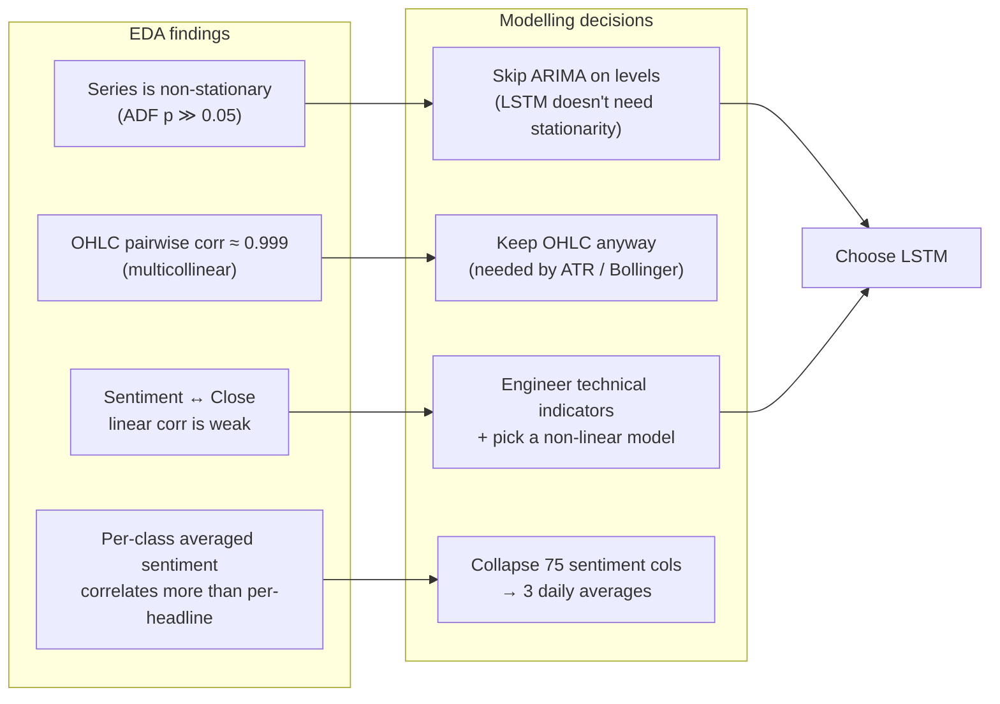
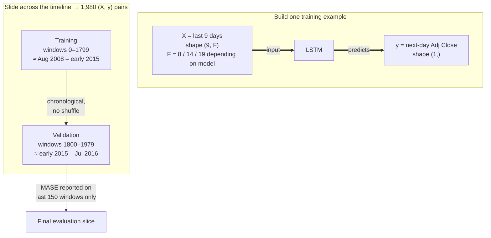

# Analysis Walkthrough

A complete, step-by-step walk through every decision in this stock-price-prediction pipeline. Each step explains **what happens**, **why it is here**, **the constraint it responds to**, and **what alternatives were considered**. Where a step uses a non-trivial technique, a short concept explainer sits beside it.

The pipeline lives in two notebooks — `prep.ipynb` (build the dataset) and `model.ipynb` (train and evaluate models) — and this document walks them in execution order.

---

## Assumptions baked in

Surface these up front so they can be challenged later.

1. **Daily granularity is enough.** Sentiment and price are aligned at the day level, with no intra-day timing — a 4 am headline and a 3 pm headline both count as "Day N news".
2. **The top-25 Reddit WorldNews headlines are an adequate proxy for "what the market read that day."** They are not finance-specific.
3. **Past prices and headlines contain enough information to predict tomorrow's price.** No external macro, sectoral, or fundamentals data is added.
4. **Market behaviour is roughly consistent across the 2008–2016 window.** A single chronological train/test split assumes the regime in the last ~180 days resembles the regime the model was trained on.
5. **`Close == Adj Close` over this period.** Stated in the dataset description; the code freely interchanges the two columns.
6. **Predicting tomorrow's *level* (not a return or a direction) is the right objective.** Regressing on price levels in a strongly trended series is intentionally hard to do better than the naive baseline.

---

## Pipeline at a glance



---

# Phase 1 — Build the dataset (`prep.ipynb`)

## Step 1. Load the two raw CSVs

**What.** Read `dataset/Combined_News_DJIA.csv` (1,989 rows × 27 cols: `Date`, `Label`, `Top1..Top25`) and `dataset/upload_DJIA_table.csv` (DJIA OHLC + `Volume` + `Adj Close`).

**Why.** The two ingredients of the project — text input and numeric input. Both need to be lined up to the same trading-day axis.

**Constraint.** The files come from different sources (Reddit WorldNews vs Yahoo Finance) and share no index other than `Date`.

**Alternative considered.** Pulling fresh headlines from a news API instead of the Kaggle snapshot — rejected because the snapshot is fixed and reproducible, which is what makes the model-to-model benchmark comparisons meaningful.

---

## Step 2. Inner-join News and Price on `Date`

```python
df_merge = pd.merge(df_news, df_price, on='Date')
```

**What.** Default inner join — keep only dates appearing in both tables.

**Why.** Markets close on weekends and US holidays, but Reddit WorldNews posts every day. An inner join drops the non-trading days automatically, since the price file has no row for them.

**Constraint.** Misaligned calendars — ~365 news days/year vs ~252 trading days.

### Concept: inner join
Set-theoretic merge — keep rows whose join key exists in *both* tables. Opposite of a left join, which keeps everything in the left table and pads NaNs for missing right-side matches.

**Alternatives considered.**
- *Left join keeping all news days, forward-filling prices.* Rejected because the target variable (tomorrow's price) wouldn't be defined for non-trading days; the model would be training to predict prices that don't exist.
- *Aggregating weekend headlines into Monday's row.* Plausibly meaningful but requires an aggregation rule to be defended. Left for future work.

---

## Step 3. Strip `b'…'` byte-string artefacts from headlines

```python
df_merge.apply(lambda x: x[2:-1] if (type(x) == str and ("b'" in x or 'b\"' in x)) else x)
```

**What.** Every headline cell in the CSV starts with `b'` and ends with `'` — a legacy artefact of how the file was originally serialised (Python 2 byte-string `repr()` written to CSV). This shaves those characters off.

**Why.** The sentiment model in Step 5 is a general-purpose text classifier. Feeding it `b"Georgia 'downs two Russian warplanes'"` forces the tokenizer to absorb a leading `b"` that has no meaning. That's a small but unnecessary distribution shift away from the sentences the model was trained on.

**Alternative considered.** A regex strip — functionally equivalent.

---

# Phase 2 — Sentiment feature extraction

## Step 4. Choose the sentiment model: `cardiffnlp/twitter-roberta-base-sentiment`

**What.** Download a pre-trained RoBERTa model fine-tuned for 3-class sentiment (negative, neutral, positive) on a Twitter corpus.

**Why.** Pre-trained model = no training data needed on our side, no labelling cost. Twitter-tuned because tweets and news headlines share characteristics — short, punchy, often opinionated.

**Constraint.** We have no sentiment labels of our own.

### Concept: sentiment analysis / RoBERTa / softmax
RoBERTa is a transformer-based language model. Fine-tuning it on a sentiment task converts it into a function `text → (P_neg, P_neu, P_pos)`, produced by a softmax over the final classification head's logits. Softmax just normalises three numbers into probabilities that sum to 1.

**Alternatives considered.**
- *VADER* (lexicon-based). Faster, but lexicon methods miss context ("not bad" scores negative) and perform weakly on news-style text.
- *FinBERT*, fine-tuned on financial news — a better fit in principle (flagged in `README.md` as the strongest known weakness). Not used because at the time, `twitter-roberta-base-sentiment` was the canonical, easy-to-call option.
- *Training a custom classifier.* Requires labels we don't have.

---

## Step 5. Score every headline → 75 features per day

```python
def get_sentiment(index):
    ...
    sentiments.append(softmax(model(encoded_input)[0].numpy()))
    while len(sentiments) < 25:
        sentiments.append(np.average(sentiments, axis=0))   # impute missing headlines
    return np.array(sentiments).reshape(-1)
```

**What.** For each of the 1,989 days, tokenise and forward each of the up-to-25 headlines through the model. Reshape into a flat vector of `25 headlines × 3 sentiment classes = 75` values. If a row has fewer than 25 headlines (some are NaN), pad with the average sentiment of the headlines that do exist.

**Why.** A time-series model can only consume a fixed-length feature vector per timestep, so a variable number of headlines per day has to be flattened into a fixed-width input.

**Constraint.** Fixed input shape required; CSV occasionally has missing top-25 entries.

**Alternatives considered.**
- *Mean-aggregate the 25 headlines into a single daily score right here* instead of carrying 75 columns through. Rejected at this stage because the EDA in Step 10 wanted to see whether *individual* headline positions (top1, top25) correlated differently with the price. The collapse to 3 averages happens later in `model.ipynb` once that question was settled.
- *Padding missing headlines with zeros.* Rejected because zero in this probability space implies "high confidence non-class," not "missing." Imputing with the row average is a softer assumption — "treat the absent headline as looking like the rest of today's news."

**Per-day transformation visualised:**



---

## Step 6. Cache merged dataset → `dataset/final_df.csv`

**What.** Persist `Date + OHLC + Adj Close + 75 sentiment columns` so the modelling notebook can skip the ~30–60 min sentiment scoring loop.

**Why.** Reproducibility + iteration speed. The sentiment step is the slowest stage by orders of magnitude; caching it lets `model.ipynb` run end-to-end in minutes.

**Alternative considered.** *Pickle instead of CSV.* Faster I/O, but CSV survives Python-version changes and is inspectable in any text editor; the dataset is small enough that CSV is fine.

---

# Phase 3 — Exploratory Data Analysis

## Step 7. Visualise the closing price over time

**What.** Line plot of `Close` against `Date`, plus a yearly boxplot.

**Why.** Eyeball the shape of the series before reaching for tools. The plot shows a roughly monotone upward trend with significant volatility around 2008–2009 (financial crisis), 2011 (debt-ceiling crisis) and 2015–2016.

**Constraint feeding Step 8.** "Is this stationary?" — every classical time-series method assumes it is, so we need to know before choosing them.

---

## Step 8. Test stationarity — Augmented Dickey-Fuller + ACF/PACF

**What.** Run the ADF test on `Close`; plot autocorrelation and partial autocorrelation.

**Why.** A formal answer to "is this stationary?". ADF returns p ≫ 0.05 → cannot reject the null of a unit root → the series is non-stationary. ACF shows slow decay, confirming visually.

### Concept: stationarity
A stationary series has a mean and variance that don't drift over time. ARMA, ARIMA, classical regression and most off-the-shelf forecasters assume stationarity. A non-stationary series like DJIA price has to either be transformed (e.g., to first differences or log-returns) or modelled with a method that doesn't care.

### Concept: ADF
Hypothesis test with null *"the series has a unit root"* (i.e. is non-stationary). p > 0.05 → fail to reject → treat as non-stationary.

### Concept: ACF / PACF
ACF = correlation of the series with its own lagged copies. PACF = the same after partialling out shorter-lag correlations. Together they hint at the order of an ARIMA model, when one is appropriate.

**Alternative considered.** *Difference the series and model first-differences directly.* Standard ARIMA move. Rejected here because the chosen model (LSTM) doesn't need stationarity, and differencing would throw away the price-*level* information that the technical indicators in Phase 4 are constructed from.

---

## Step 9. Correlation between OHLC columns

**What.** Heatmap of `Open`, `High`, `Low`, `Close`.

**Why.** Quickly diagnose redundancy. Pairwise correlations are all ~0.999 — these four columns mostly carry the same information.

**Decision.** Keep all four; they aren't *literally* equal (High and Low capture intra-day range), and they feed downstream features (ATR, Bollinger) that need High/Low specifically. Let the LSTM ignore the redundancy.

A follow-up cell looks at correlations between *differences* of OHLC (e.g. `|Open − Close.shift(1)|`); those correlations are low (max ≈ 0.31), confirming the redundancy lives in levels, not in changes.

---

## Step 10. Sentiment ↔ closing-price correlation

**What.** Compute correlations between each of the 75 sentiment columns (plus per-class min/avg/max) and `Close`.

**Why.** Cheap sanity check — if sentiment is going to help, *some* linear correlation should appear. It barely does; every coefficient is small. **Per-class averages** correlate slightly more strongly than per-headline scores, which is the observation that justifies the collapse-to-3-averages in Step 19.

**Reading.** Weak linear correlation doesn't disprove sentiment-as-signal — it just rules out a linear model. This motivates Phase 5's LSTM choice directly.

**Alternative considered.** *Mutual information* instead of Pearson correlation, which captures non-linear dependence. Reasonable, but the cheap linear pass is enough to justify the modelling decision.

---

# Phase 4 — Engineer technical-indicator features

The premise after Phase 3: linear correlations with `Close` are too weak for a linear model to work. The features below are standard traders' tools — they encode **trend**, **momentum** and **volatility** into derived columns an LSTM can exploit.

## Step 11. EMA-12 and EMA-26

```python
df['ShortEMA'] = df['Close'].ewm(span=12, adjust=False).mean()
df['LongEMA']  = df['Close'].ewm(span=26, adjust=False).mean()
```

### Concept: EMA
A moving average where recent observations are weighted more than older ones. Span = N means the weight at lag k decays like `(1 − 2/(N+1))^k`. EMA reacts faster than a Simple Moving Average and matches the intuition that markets respond more to recent news.

**Why two spans?** EMA on its own is a smoothed version of the input. The *difference* between a short and a long EMA (next step, MACD) is what carries new information.

---

## Step 12. MACD + Signal Line

```python
df['MACD'] = df['ShortEMA'] - df['LongEMA']
df['Signal Line'] = df['MACD'].ewm(span=9, adjust=False).mean()
```

### Concept: MACD
*Moving Average Convergence / Divergence* — short EMA minus long EMA. When MACD crosses above its Signal Line (a 9-day EMA of MACD), traders read it as a bullish momentum shift; the reverse is bearish.

**Why.** Captures "is the short-term trend pulling away from the long-term trend?" — structurally different from the raw price level.

**Derivation chain:**



---

## Step 13. RSI-14

### Concept: Relative Strength Index
`100 − 100 / (1 + AvgGain / AvgLoss)` over the past 14 days. Values near 70 → "overbought"; near 30 → "oversold". Bounded in [0, 100].

**Why.** Adds a non-linear function of recent price changes that no other feature here captures.

---

## Step 14. SMA-20

```python
df['MA'] = df['Close'].rolling(20).mean()
```

### Concept: SMA
Plain rolling mean. Slower than EMA, but a useful reference level for Bollinger Bands (Step 17) and a smoother baseline.

---

## Step 15. ATR-14

### Concept: Average True Range
A volatility measure. For each day, *true range* = `max(High − Low, |High − PrevClose|, |Low − PrevClose|)`; ATR is its rolling mean. Tells you how much the price has been swinging.

**Why.** None of the features so far carry volatility information — they're all level- or trend-oriented. ATR fills that gap.

---

## Step 16. Stochastic Oscillator (%K and %D)

```python
df['%K'] = 100 * (df['Close'] - low_min) / (high_max - low_min)
df['%D'] = df['%K'].rolling(window=3).mean()
```

### Concept
`%K` asks: *where does today's close sit within the recent 14-day high-low range?* Bounded in [0, 100]. `%D` smooths `%K` with a 3-day average.

**Why.** Complementary momentum signal: RSI measures recent gains-vs-losses, Stochastic measures position-within-range.

---

## Step 17. Bollinger Bands (±2σ)

```python
df['Upper Band'] = SMA20 + 2 * std20
df['Lower Band'] = SMA20 - 2 * std20
```

### Concept
An envelope around the moving average that widens with volatility and narrows when it falls. Prices that pierce the upper or lower band are statistically "far" from their recent mean.

**Why.** Encodes "how unusual is today's price given recent variance?" — a normalised distance measure built on top of the SMA.

---

## Step 18. EDA conclusion: a linear model won't work

After all the engineered features, no single column correlates strongly with `Close`. This is the moment that justifies every modelling choice in Phase 6: if the relationship is non-linear, the model must be non-linear → LSTM.

**How each EDA finding fed a modelling decision:**



---

# Phase 5 — Modelling setup (`model.ipynb`)

## Step 19. Reload `final_df.csv`, collapse sentiment to three averages

```python
for prefix in ["negative", "neutral", "positive"]:
    final_df[f"{prefix}_average"] = final_df[[f"{prefix}_top{i}" for i in range(1, 26)]].mean(axis=1)

reg_final_df = final_df[["Open", "High", "Low", "Close", "Adj Close",
                          "positive_average", "negative_average", "neutral_average"]]
```

**What.** Collapse the 75 per-headline sentiment columns to 3 daily averages.

**Why.** Step 10 showed averages correlate more strongly than per-headline values. 75 features for ~1,800 training samples is also a poor curse-of-dimensionality ratio.

**Constraint.** Small sample size relative to feature count.

**Alternatives considered.**
- *Keep all 75 columns and let regularisation handle it.* Unstable — with this few samples the model would overfit headline-specific noise.
- *PCA the 75 columns to ~10 components.* More principled than averaging, but the three-average baseline is interpretable and worked.

---

## Step 20. Define the naive baseline and the MASE metric

```python
def get_MASE(y_true, y_pred):
    naive_forecast = y_true[:-1]
    return get_MAE(y_true, y_pred) / get_MAE(y_true[1:], naive_forecast)
```

### Concept: naive baseline
*Tomorrow = today.* For a strongly-trended daily financial series, this is famously hard to beat in level-space.

### Concept: MASE
`MAE(model) / MAE(naive)`. MASE = 1 → as good as the naive baseline. < 1 → better. Scale-free, so comparable across series with different price ranges.

**Why this metric.** RMSE in USD doesn't tell you whether the model learned anything — it just reflects the price scale. MASE normalises against the hardest free baseline.

---

## Step 21. Sliding-window construction + chronological train/val split

```python
def preprocess(df, n_future, n_past):
    scaler = StandardScaler().fit(df)
    scaled = scaler.transform(df)
    X, y = [], []
    for i in range(n_past, len(scaled) - n_future + 1):
        X.append(scaled[i - n_past:i, :])
        y.append(scaled[i + n_future - 1:i + n_future, 4])  # col 4 = Adj Close
    X_train, X_valid = X[:1800], X[1800:]
    ...
```

**What.** Standard-scale every column, build sliding windows of `n_past` consecutive days as input and the next day's `Adj Close` as target, take the first 1,800 windows as train and the rest (~180) as validation.

**Why each piece.**

- **StandardScaler.** Price columns are in the thousands, sentiment columns are in [0,1]. Without scaling, the price columns would dominate the gradient.
- **Sliding windows.** Forces the model to learn from a fixed look-back — what an LSTM is built to consume.
- **Chronological split (no shuffling).** A random shuffle would leak future days into training. Time series must be split *forward in time*.
- **Hardcoded 1,800 cutoff.** ≈ 90/10 train/val. Fixed by sample count rather than date so the boundary is stable across reruns even when feature-engineering NaN drops change row counts.

**Window construction and split, visualised:**



### Concept: StandardScaler
Subtract column mean, divide by column std → output has mean 0, std 1 per column. Reversible.

**Alternatives considered.**
- *Min-Max scaling to [0,1].* Equally valid for LSTMs; StandardScaler was picked because it handles outliers slightly more gracefully.
- *Predict daily returns instead of price levels.* Rejected because the technical indicators (Bollinger, EMA…) are functions of *levels* and would need re-derivation.
- *Walk-forward cross-validation.* More rigorous than a single 1,800/180 split — flagged in `README.md` as a known limitation.

---

# Phase 6 — Iterate LSTM variants

### Concept: LSTM
A recurrent neural network designed to learn dependencies in sequences. Each cell carries a "memory" state that is selectively updated and forgotten as the sequence flows through it — this gating is what lets it model long-range temporal patterns better than a vanilla RNN.

`return_sequences=True` emits an output per timestep (so the layer can be stacked beneath another LSTM); `return_sequences=False` collapses to a single vector per input window (so it can feed a Dense layer).

---

## Step 22. Model 1 — Base LSTM

```python
Sequential([
    LSTM(32, return_sequences=True),
    LSTM(16, return_sequences=False),
    Dense(8, activation='relu'),
    Dense(1, activation='linear'),
])
# Adam, default LR, 10 epochs, no regularisation
```

**What.** Minimal architecture, 10 epochs, default Adam. **MASE ≈ 1.56.**

**Why.** Establish a baseline that has *some* sequence-modelling capacity but no fine-tuning, so the value of each subsequent change is measurable.

**Reading.** MAE is 1.56× the naive — much worse than the trivial baseline. Confirms there's room (and need) to tune.

---

## Step 23. Model 2 — Deeper LSTM + L2 + He-init + exponential LR decay + early stopping

```python
LSTM(32, ..., he_normal, l2(0.0013)),
LSTM(32, ..., he_normal, l2(0.0013)),
LSTM(16, ..., he_normal, l2(0.0013)),
LSTM(16, return_sequences=False, ...),
Dense(8, activation='relu', ...),
Dense(1, activation='linear'),
# Adam(ExponentialDecay(initial_lr=0.02)), 200 epochs, EarlyStopping(patience=15)
```

**What.** Same base shape but 4 LSTM layers, with three regularisation tricks and a learning-rate schedule. **MASE ≈ 1.44.**

**Why depth.** More representational capacity for non-linear patterns. The risk is overfitting, which is why the new pieces below are added together with the depth.

### Concept: L2 regularisation
Adds `λ · Σ weights²` to the loss. Penalises large weights, constraining the network from memorising training noise. λ = 0.0013 is small enough not to swamp the data term.

### Concept: He-normal initialisation
A weight init scheme matched to ReLU-like activations — weights drawn from `N(0, 2/n_in)`. Keeps activation variance roughly constant across layers, preventing the vanishing/exploding-gradient problem that deep nets are prone to.

### Concept: Exponential learning-rate decay
Start at a high LR (0.02), shrink it geometrically over training. Large steps early help the optimiser escape bad regions; small steps later let it settle into a minimum.

### Concept: Early stopping
Stop training when the validation metric hasn't improved in `patience` epochs. Cheap, automatic regularisation; `restore_best_weights=True` rolls back to the best-seen weights when it triggers.

**Reading.** Deeper + regularised is better than the base (1.44 vs 1.56) but still well above 1 — the architecture is more expressive, but the data fundamentally limits how good level-prediction can get.

---

## Step 24. Model 3 — Model 1 shape + Model 2's tuning tricks

```python
# Same 2-LSTM architecture as Model 1
# + L2, He, Adam(lr=0.03), EarlyStopping, ReduceLROnPlateau
```

**What.** Strip the extra depth from Model 2 back to Model 1's two-LSTM shape; keep everything else. **MASE ≈ 1.07.**

**Why.** Test whether depth was helping at all, or whether L2 + LR strategy alone made the difference.

### Concept: ReduceLROnPlateau
A second LR-schedule strategy. Watches the validation loss; if it stalls for `patience` epochs, multiplies LR by `factor` (here 0.6). Smarter than blind exponential decay when convergence happens in fits and starts.

**Reading.** Removing the two extra LSTM layers *improved* MASE (1.44 → 1.07). Depth wasn't paying for itself — Model 2 was over-parameterised for ~1,800 training windows. This is the moment that justifies keeping a shallow shape for every subsequent model.

---

## Step 25. Grid-search `n_past` over 1..20

**What.** Re-run Model 3 twenty times, varying only the lookback window length; plot MASE and MSE versus `n_past`.

**Why.** The original choice of `n_past = 9` was a heuristic guess; this step makes it defensible.

**Result.** `n_past = 9` minimises MASE and MSE *jointly* — a couple of other values do better on one but worse on the other. Keep 9.

**Alternative considered.** Grid-searching jointly over `n_past`, batch-size and LR. Pure compute trade-off; the single-axis sweep is enough to defend the chosen value.

---

## Step 26. Model 4 — Model 3 + EMA / MACD / RSI / SMA features

**What.** Re-engineer EMA(12), EMA(26), MACD, Signal Line, RSI(14), SMA(20) into `reg_final_df`, drop the first 2 rows to clear NaNs, retrain. Now **14** input features per timestep. **MASE ≈ 1.03.**

**Why.** Phase 4 motivated these features — this is when they actually enter the model.

**Reading.** Modest improvement over Model 3 (1.07 → 1.03). Inching toward the baseline.

---

## Step 27. Model 5 — Model 4 + ATR / Stochastic / Bollinger + Nadam

**What.** Add ATR(14), %K, %D, Upper Band, Lower Band; drop first 21 rows to clear NaNs; swap Adam for Nadam at LR 0.037. **MASE ≈ 0.981 — beats the naive baseline.**

### Concept: Nadam
Adam with Nesterov-style momentum. Adam applies momentum at the current point; Nadam applies the gradient at the *lookahead* point — where momentum would land you — which often yields a slightly cleaner descent.

**Why this combination works.** The volatility / range features (ATR, Bollinger, Stochastic) carry information the trend features (EMA, MACD, RSI) didn't. Nadam's slight edge over Adam helps land at a marginally better optimum on a problem where every fraction of a MASE-point matters.

---

## Step 28. Model 6 — Model 5 ablated by removing sentiment

**What.** Drop the three sentiment columns, retrain with identical architecture. **MASE ≈ 1.03 — back above 1.**

**Why.** Falsification check. If sentiment doesn't carry signal, removing it shouldn't hurt. Removing it *does* hurt (0.981 → 1.030), so we conclude sentiment adds real, modest, repeatable value on top of the technicals.

**Alternatives considered.**
- *Drop sentiment from Model 3 (no engineered features)* to isolate sentiment's contribution earlier in the chain. Cleaner ablation; current design only tests sentiment on top of the full feature set.
- *Permutation importance* instead of an ablation retrain. Cheaper but less direct.

---

## Model lineage — the whole iteration story in one picture

```mermaid
flowchart TD
    M1["<b>Model 1: Base LSTM</b><br/>2-LSTM (32 → 16) + Dense<br/>no reg, default Adam, 10 epochs<br/>8 features<br/>MASE = 1.56"]
    M1 -- "+ depth (4 LSTMs)<br/>+ L2(0.0013) + He-init<br/>+ ExpDecay LR<br/>+ EarlyStopping" --> M2

    M2["<b>Model 2: Deep LSTM + tuning</b><br/>4-LSTM stack<br/>8 features<br/>MASE = 1.44"]
    M2 -- "depth not paying off →<br/>strip back to 2-LSTM,<br/>keep all tuning tricks" --> M3

    M3["<b>Model 3: Fine-tuned Base</b><br/>2-LSTM + L2 + He<br/>+ Adam(0.03) + ReduceLROnPlateau<br/>8 features<br/>MASE = 1.07"]
    M3 -- "grid-search n_past 1..20<br/>→ 9 wins on both MASE + MSE" --> M3b["n_past = 9<br/>locked in"]
    M3b -- "+ ShortEMA, LongEMA,<br/>MACD, Signal Line,<br/>RSI(14), SMA(20)" --> M4

    M4["<b>Model 4: + trend indicators</b><br/>14 features<br/>MASE = 1.03"]
    M4 -- "+ ATR(14), %K, %D,<br/>Bollinger ±2σ<br/>+ swap Adam → Nadam(0.037)" --> M5

    M5["<b>Model 5: + volatility / range</b><br/>19 features<br/>MASE = 0.981 ✓"]
    M5 -- "ablation:<br/>drop 3 sentiment cols" --> M6

    M6["<b>Model 6: no sentiment</b><br/>16 features<br/>MASE = 1.03"]

    M5 -. crosses below 1.0 .-> R["Beats the naive baseline<br/>('tomorrow = today')"]
    M5 -. compared to M6 .-> S["Sentiment ≈ 0.05 MASE<br/>worth of signal"]
    M6 -. compared to M5 .-> S

    classDef best fill:#c8e6c9,stroke:#2e7d32,stroke-width:3px
    classDef bad fill:#ffcdd2,stroke:#c62828,stroke-width:2px
    classDef note fill:#fff9c4,stroke:#f9a825
    class M5 best
    class M1 bad
    class R,S note
```

---

# Phase 7 — Evaluation

## Step 29. Aggregate results table and bar charts

**What.** Tabulate MASE, MSE, RMSE for all six models; render three side-by-side bar charts.

**Why.** Visualising the progression makes the story plain: each modelling decision was justified by a measurable drop in MASE, culminating in Model 5 crossing under 1.

---

# Open questions / things to verify

Places where I either don't fully trust the code or want to revisit before defending the project.

1. **Scaler is fit on the full dataset, not just the training portion.** `preprocess()` calls `scaler.fit(df)` *before* splitting into train/valid, so validation rows influence the scaling mean and std used to transform training data. Strictly speaking, that's data leakage. In practice the impact is tiny here (~180 validation rows out of ~1,980, and StandardScaler doesn't memorise specific values), but the defensible version is to fit on `df[:1800]` and transform both halves with the train-only scaler.

2. **The "RMSE" column in the results table is not in price units.** `model_predict` "inverse-transforms" the validation MSE (a variance-like quantity, in scaled-units²) using `scaler.inverse_transform`, which is the affine map `x → x · scale + mean`. That's the correct inverse for a *value*, not for a *variance*. The result is roughly `mean(Adj Close) + small`, which is why every reported RMSE clusters at ~116 regardless of how well the model actually predicts. MASE is unaffected because it's computed on the inverse-transformed prediction array directly — but the published RMSE should be regenerated (`scaled_MSE · scale²`, no `+ mean`) before quoting it externally.

3. **NaN-row drop counts (`.iloc[2:]` then `.iloc[21:]`) are heuristic.** After the first round of indicators only RSI introduces a NaN (and only at row 0, because `.diff(1)`); dropping 2 rows is conservative but harmless. After the second round, ATR/Stoch use a 14-day rolling without `min_periods` (up to 13 head NaNs) and Bollinger uses a 20-day rolling (up to 19 head NaNs). Dropping 21 rows is conservative but the *number* doesn't follow from the math — a `.dropna()` would be cleaner and self-documenting.

4. **`model_predict` compares predicted Adj Close (col 4 of `reg_final_df`) against `final_df.iloc[-150:, 4]`.** In `final_df` (with `Date` at col 0), column 4 is `Close`, not `Adj Close`. In this dataset `Close == Adj Close`, so the comparison still works, but the code is fragile to that equality holding.

5. **Validation set has ~180 windows but evaluation is on the last 150.** `model.fit` monitors all 180 for early stopping; `model_predict(150, ...)` reports MASE on the last 150 only. Two slightly different cuts of the data driving different decisions — not wrong, but worth being aware of.

6. **Manual hyperparameter tuning.** LR values (0.02, 0.03, 0.037), L2 strength (0.0013), patience values, batch size — all chosen by trial. No grid or Bayesian search. `README.md` flags this; restating it here for completeness.

7. **One single chronological split.** The validation window (~last 180 trading days, roughly late 2015 to mid-2016) is one specific time region. A MASE win on this slice doesn't guarantee a MASE win on, say, the 2010–2011 slice. A walk-forward / time-series CV would harden the result.

---

# The chain of decisions in one paragraph

We want to predict tomorrow's DJIA close. Price data alone is necessary; we add Reddit news as a hypothesised second signal, but it's text, so we run it through a pre-trained sentiment model to get 75 numeric features per day. Before modelling, EDA tells us the series is non-stationary and that no single feature correlates strongly with the target, which rules out classical linear / ARIMA approaches. To give a non-linear model more structured features, we engineer technical indicators that encode trend (EMA, MACD), momentum (RSI, Stochastic) and volatility (ATR, Bollinger). We pick an LSTM because the inputs are sequences and the target relationship is non-linear; we compare every model against the naive "tomorrow = today" baseline using MASE. We start simple, then add regularisation and LR scheduling one at a time; we test depth and find it hurts; we tune the lookback window (9). We add features in two batches and watch MASE drop each time. Model 5 crosses under 1. We confirm sentiment matters by ablating it in Model 6 — MASE returns above 1. Done.
